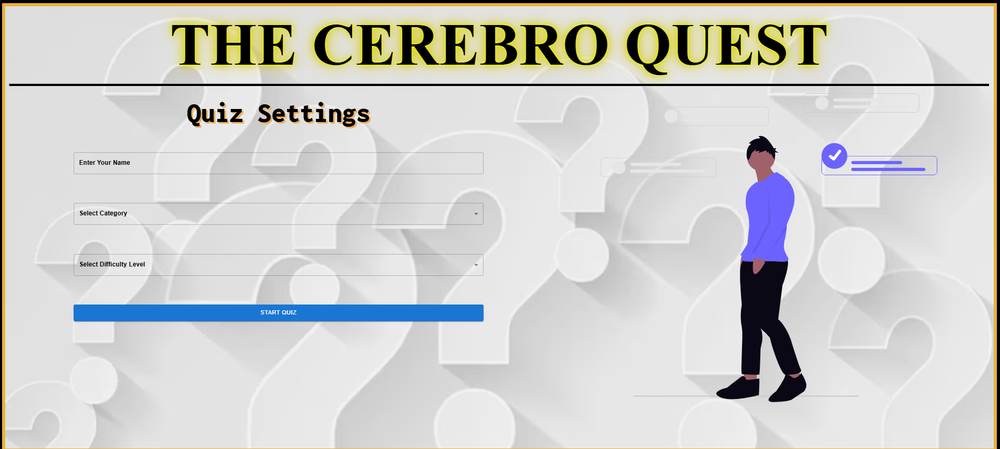
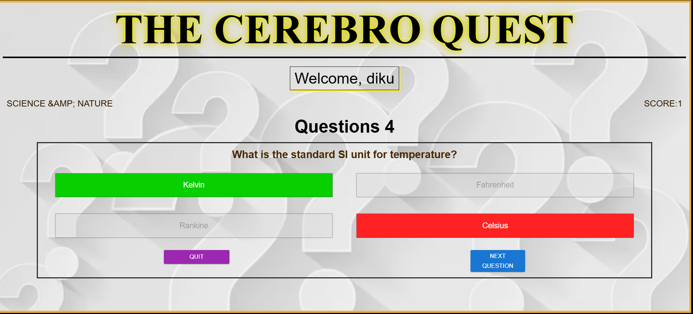
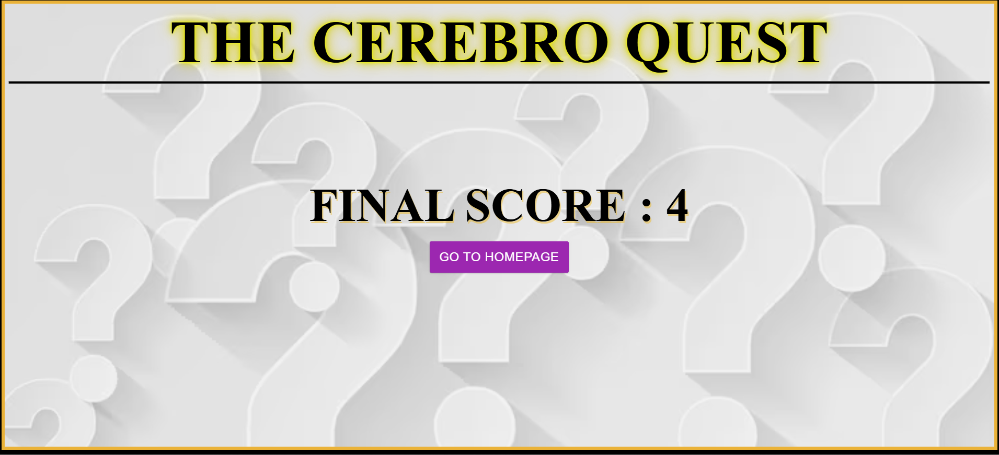

# 🧠 CerebroQuest

**CerebroQuest** is a dynamic and interactive quiz web application built with React. It challenges users with multiple-choice questions, tracks scores, and provides real-time feedback in a visually engaging format.

---

## 🚀 Features

- 🎯 Multiple-choice questions with real-time feedback
- ✨ Stylish UI with glowing headers and responsive layout
- ✅ Score tracking and result display
- 🧩 Fully responsive (mobile & desktop)
- 🔄 Option to restart or quit the quiz anytime

---

## 🛠️ Built With

- [React](https://reactjs.org/)
- [Vite](https://vitejs.dev/) for fast bundling
- [Material UI](https://mui.com/) for buttons and controls
- Custom CSS with animations and media queries

---

## 📸 Screenshots
<<<<<<< HEAD


=======
#HOMEPAGE


#QUIZ PAGE



#RESULT PAGE


>>>>>>> 3226b075695baaafc3564f4a994e931bfda3d1e4


---

## 🔧 Installation

1. **Clone the repository:**
   ```bash
   git clone https://github.com/diksharaj2005/quiz_react_app.git
   cd cerebroquest
